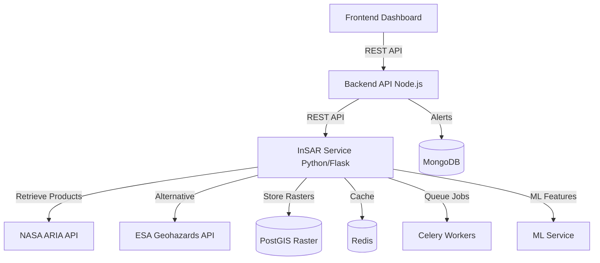

# InSAR Displacement Detection - Design Document

## Overview

This design document specifies the architecture for Phase 3 of the satellite integration system: InSAR (Interferometric Synthetic Aperture Radar) Displacement Detection. This feature adds ground movement monitoring capabilities by integrating pre-processed Sentinel-1 SAR displacement products from NASA's Advanced Rapid Imaging and Analysis (ARIA) project or ESA's Geohazards Exploitation Platform.

### Background

InSAR technology measures ground displacement at millimeter to centimeter precision by comparing the phase differences between sequential SAR acquisitions. Unlike optical satellites (Sentinel-2) that measure surface characteristics, InSAR penetrates cloud cover and operates day/night to detect subtle ground deformation that precedes catastrophic landslides. Pre-processed displacement products eliminate the computational complexity of raw SAR interferometry processing, making this capability accessible for operational early warning systems.

### Key Design Decisions

**Decision 1: Use Pre-Processed Products Instead of Raw SAR Processing**
- **Rationale**: Raw SAR interferometry requires specialized expertise, massive computational resources (100+ GB RAM), and complex workflows (coregistration, interferogram generation, phase unwrapping, atmospheric correction). Pre-processed products from NASA ARIA and ESA Geohazards provide validated displacement time series ready for analysis.
- **Trade-off**: Dependency on external data availability (7-14 day latency) vs operational feasibility
- **Alternative Considered**: On-premise SAR processing with SNAP or ISCE2 - rejected due to computational requirements

**Decision 2: Python-Based Microservice Architecture**
- **Rationale**: Consistency with existing `satellite_service` (Google Earth Engine API). Python ecosystem provides robust geospatial libraries (rasterio, gdal, xarray) and integrates naturally with ML feature extraction.
- **Trade-off**: Adds another Python service vs implementing in Node.js backend - chosen for geospatial library maturity

**Decision 3: PostGIS Raster Storage for Displacement Data**
- **Rationale**: Enables spatial queries, handles multi-temporal raster data efficiently, integrates with existing PostgreSQL database
- **Alternative Considered**: Cloud-Optimized GeoTIFFs on object storage - viable for read-heavy workloads but PostGIS chosen for query flexibility

**Decision 4: Asynchronous Processing with Job Queue**
- **Rationale**: Displacement product retrieval and processing can take 1-2 minutes for 100 km² areas. Asynchronous processing prevents API timeout and enables concurrent processing of multiple monitoring areas.
- **Implementation**: Redis-backed job queue with Celery workers

### Research Summary

**NASA ARIA Standard Displacement Products**
- API Endpoint: `https://grfn.asf.alaska.edu/` (ARIA Geocoded Unwrapped Interferogram Products)
- Coverage: Global, Sentinel-1 interferograms with 90m spatial resolution
- Format: NetCDF with displacement in millimeters
- Temporal Baseline: 6-day, 12-day, or seasonal pairs
- Latency: 7-14 days from SAR acquisition to product availability
- Access: Requires NASA Earthdata login credentials
- Reference: https://aria.jpl.nasa.gov/products/standard-displacement-products/

**ESA Geohazards TEP API**
- Platform: Thematic Exploitation Platform for Geohazards
- Coverage: Global InSAR processing on-demand
- Format: GeoTIFF, NetCDF
- Processing: On-demand interferogram generation using SNAP engine
- Latency: Variable (processing time + 7-14 days)
- Access: Requires ESA account and API key
- Reference: https://geohazards-tep.eu/

**Coherence Quality Indicators**
- Coherence Range: 0 to 1 (1 = perfect correlation)
- Typical Thresholds: >0.3 for acceptable quality, >0.5 for good quality
- Physical Interpretation: Measures phase stability between SAR acquisitions
- Degradation Factors: Vegetation change, soil moisture, steep slopes, temporal decorrelation

**Displacement Velocity Analysis**
- Linear Velocity: Rate of displacement in mm/year derived from linear regression of time series
- Acceleration: Second derivative of displacement time series in mm/year²
- Significance Threshold: 50 mm/year velocity commonly used for landslide early warning
- Acceleration Threshold: 20 mm/year² indicates exponential deformation characteristic of pre-failure acceleration

## Architecture

### System Context

The InSAR Displacement Detection system integrates with:

1. **External Data Sources**:
   - NASA ARIA API (primary) for Sentinel-1 displacement products
   - ESA Geohazards TEP API (alternative) for displacement products
   
2. **Internal Systems**:
   - Backend API (Node.js/Express) - orchestrates monitoring areas and alert notifications
   - Satellite Service (Python/Flask) - sibling service for Google Earth Engine data
   - ML Service (Python) - consumes displacement features for landslide prediction
   - Frontend Dashboard (React) - displays displacement maps and time series

3. **Data Storage**:
   - PostgreSQL with PostGIS - displacement raster storage and metadata
   - Redis - job queue and caching layer
   - MongoDB - alert history and logs (existing system)

### High-Level Architecture



### Service Deployment

- **InSAR Service**: Python/Flask application deployed as separate microservice (similar to existing `satellite_service`)
- **Celery Workers**: Separate worker processes for asynchronous displacement processing
- **Redis**: In-memory cache and job queue broker
- **Deployment Target**: Render.com (consistent with existing services) or containerized deployment

## Components and Interfaces

### Core Components

#### 1. InSAR Service (Flask Application)

**Responsibilities**:
- Expose REST API endpoints for displacement data access
- Orchestrate displacement product retrieval and processing
- Manage caching and data retention policies
- Generate displacement alerts based on thresholds
- Provide health checks and monitoring metrics

**Key Classes**:
```python
class InSARService:
    """Main Flask application for InSAR API"""
    def __init__(self, config: InSARConfig)
    def get_displacement(self, area_id: str, date_range: DateRange) -> DisplacementResult
    def get_time_series(self, lat: float, lon: float) -> TimeSeriesData
    def get_alerts(self, area_id: str) -> List[DisplacementAlert]
```

#### 2. ARIA Client

**Responsibilities**:
- Authenticate with NASA Earthdata
- Query ARIA API for available displacement products
- Download and parse NetCDF displacement products
- Extract displacement values and coherence layers

**Key Classes**:
```python
class ARIAClient:
    """Client for NASA ARIA Standard Displacement Products"""
    def __init__(self, username: str, password: str)
    def authenticate(self) -> bool
    def query_products(self, bbox: BoundingBox, date_range: DateRange) -> List[ProductMetadata]
    def download_product(self, product_id: str) -> Path
    def parse_netcdf(self, file_path: Path) -> DisplacementProduct
```

**API Integration Details**:
- Base URL: `https://grfn.asf.alaska.edu/api`
- Authentication: HTTP Basic Auth with NASA Earthdata credentials
- Query Parameters: `bbox`, `start_date`, `end_date`, `platform=Sentinel-1`
- Response Format: JSON list of product URLs
- Product Format: NetCDF with variables `displacement`, `coherence`, `unwrapped_phase`

#### 3. Geohazards Client (Alternative)

**Responsibilities**:
- Authenticate with ESA Geohazards TEP
- Query TEP API for displacement products
- Download GeoTIFF or NetCDF products
- Parse ESA-specific metadata formats

**Key Classes**:
```python
class GeohazardsClient:
    """Client for ESA Geohazards Exploitation Platform"""
    def __init__(self, api_key: str)
    def query_products(self, bbox: BoundingBox, date_range: DateRange) -> List[ProductMetadata]
    def download_product(self, product_id: str) -> Path
    def parse_geotiff(self, file_path: Path) -> DisplacementProduct
```

#### 4. Displacement Processor

**Responsibilities**:
- Convert displacement products to standardized GeoTIFF format
- Transform coordinate systems to WGS84
- Extract and validate coherence quality indicators
- Clip rasters to monitoring area boundaries
- Resample to target spatial resolution (10m for consistency with Sentinel-2)
- Store processed rasters in PostGIS

**Key Classes**:
```python
class DisplacementProcessor:
    """Processes raw displacement products to standardized format"""
    def __init__(self, db_connection: Database)
    def process_product(self, product: DisplacementProduct, area: MonitoringArea) -> ProcessedRaster
    def standardize_format(self, product: DisplacementProduct) -> GeoTIFF
    def extract_coherence(self, product: DisplacementProduct) -> CoherenceLayer
    def clip_to_area(self, raster: GeoTIFF, area: MonitoringArea) -> GeoTIFF
    def resample(self, raster: GeoTIFF, target_resolution_m: int) -> GeoTIFF
    def store_raster(self, raster: GeoTIFF, metadata: RasterMetadata) -> str
```

**Processing Pipeline**:
1. Read NetCDF or GeoTIFF product
2. Extract displacement and coherence bands
3. Convert displacement units to millimeters
4. Reproject to EPSG:4326 (WGS84)
5. Clip to monitoring area bounding box
6. Resample to 10m resolution using bilinear interpolation
7. Compute quality mask (coherence < 0.3)
8. Store as PostGIS raster with metadata

#### 5. Time Series Analyzer

**Responsibilities**:
- Aggregate displacement products into temporal sequences
- Compute cumulative displacement time series
- Calculate displacement velocity using linear regression
- Detect displacement acceleration
- Generate time series for point queries

**Key Classes**:
```python
class TimeSeriesAnalyzer:
    """Analyzes displacement time series for trends and acceleration"""
    def __init__(self, db_connection: Database)
    def get_time_series(self, lat: float, lon: float, area_id: str) -> TimeSeriesData
    def compute_velocity(self, time_series: TimeSeriesData) -> VelocityResult
    def detect_acceleration(self, time_series: TimeSeriesData) -> AccelerationResult
    def flag_high_risk_pixels(self, area_id: str, velocity_threshold_mm_year: float) -> List[RiskPixel]
```

**Velocity Calculation**:
- Method: Ordinary Least Squares (OLS) linear regression
- Input: Time series of (date, displacement) pairs
- Output: Velocity (mm/year), R² coefficient, standard error
- Minimum Points: Requires ≥3 observations for valid velocity

**Acceleration Detection**:
- Method: Second-order polynomial fit or piecewise linear regression
- Acceleration Metric: Change in velocity between consecutive time windows
- Time Window: 6-month sliding windows
- Threshold: 20 mm/year² indicates exponential acceleration

#### 6. Alert Engine

**Responsibilities**:
- Evaluate displacement data against configurable thresholds
- Generate displacement alerts for exceeding thresholds
- Aggregate spatially clustered high-risk pixels
- Suppress duplicate alerts within time windows
- Store alert history for audit

**Key Classes**:
```python
class AlertEngine:
    """Generates and manages displacement alerts"""
    def __init__(self, config: AlertConfig, db_connection: Database)
    def evaluate_thresholds(self, area_id: str) -> List[DisplacementAlert]
    def aggregate_spatial_clusters(self, high_risk_pixels: List[RiskPixel]) -> List[AreaAlert]
    def suppress_duplicates(self, new_alert: DisplacementAlert, history: List[DisplacementAlert]) -> bool
    def store_alert(self, alert: DisplacementAlert) -> str
```

**Alert Logic**:
1. Query processed displacement data for monitoring area
2. Identify pixels exceeding velocity threshold (default: 50 mm/year)
3. Identify pixels exceeding cumulative displacement threshold (default: 100 mm)
4. Identify accelerating pixels (acceleration > 20 mm/year²)
5. Spatially cluster high-risk pixels using DBSCAN (epsilon=100m)
6. Generate one area-based alert per cluster
7. Check alert history for duplicates within 7-day window
8. Store new alerts in database and notify backend API

#### 7. ML Feature Extractor

**Responsibilities**:
- Extract displacement statistics for monitoring areas
- Compute aggregate displacement metrics
- Generate binary flags for threshold exceedance
- Normalize features for ML model input
- Handle missing data gracefully

**Key Classes**:
```python
class MLFeatureExtractor:
    """Extracts displacement features for machine learning"""
    def __init__(self, db_connection: Database)
    def extract_features(self, area_id: str, date: datetime) -> DisplacementFeatures
    def compute_statistics(self, raster: GeoTIFF) -> DisplacementStats
    def normalize_features(self, features: DisplacementFeatures) -> NormalizedFeatures
```

**Feature Definitions**:
- `mean_displacement_mm`: Mean displacement across all valid pixels
- `max_displacement_mm`: Maximum displacement value in area
- `displacement_std_mm`: Standard deviation of displacement
- `mean_velocity_mm_year`: Mean velocity across all pixels
- `max_velocity_mm_year`: Maximum velocity in area
- `velocity_std_mm_year`: Standard deviation of velocity
- `threshold_exceeded_flag`: Binary (1 if any pixel > 50 mm/year, else 0)
- `acceleration_detected_flag`: Binary (1 if acceleration > 20 mm/year², else 0)
- `mean_coherence`: Mean coherence quality indicator
- `low_coherence_percentage`: Percentage of pixels with coherence < 0.3

**Missing Data Handling**:
- If no displacement data available for date: Set all features to `null`
- ML model should handle null values (e.g., mean imputation or exclude sample)
- Normalization: Min-max scaling to [0, 1] range using historical min/max values

### API Endpoints

#### REST API Specification

**Base URL**: `/api/insar`

##### 1. Get Displacement Data
```
GET /api/insar/displacement
```

**Query Parameters**:
- `area_id` (required): Monitoring area identifier
- `start_date` (optional): ISO 8601 date (default: 30 days ago)
- `end_date` (optional): ISO 8601 date (default: today)
- `return_format` (optional): `geotiff` or `geojson` (default: `geojson`)

**Response (GeoJSON)**:
```json
{
  "type": "FeatureCollection",
  "features": [
    {
      "type": "Feature",
      "geometry": {"type": "Point", "coordinates": [76.52, 30.97]},
      "properties": {
        "displacement_mm": 45.3,
        "velocity_mm_year": 62.1,
        "coherence": 0.78,
        "acquisition_date": "2024-01-15",
        "quality": "good"
      }
    }
  ],
  "metadata": {
    "area_id": "area_001",
    "date_range": {"start": "2023-12-01", "end": "2024-01-15"},
    "source": "NASA_ARIA",
    "resolution_m": 10,
    "count": 1523
  }
}
```

##### 2. Get Time Series
```
GET /api/insar/timeseries
```

**Query Parameters**:
- `lat` (required): Latitude in decimal degrees
- `lon` (required): Longitude in decimal degrees
- `area_id` (optional): Monitoring area ID for context
- `buffer_m` (optional): Buffer radius in meters (default: 50)

**Response**:
```json
{
  "location": {"latitude": 30.97, "longitude": 76.52},
  "time_series": [
    {
      "date": "2023-06-01",
      "displacement_mm": 0.0,
      "coherence": 0.82,
      "uncertainty_mm": 3.2
    },
    {
      "date": "2023-07-01",
      "displacement_mm": 12.5,
      "coherence": 0.78,
      "uncertainty_mm": 3.8
    }
  ],
  "analysis": {
    "velocity_mm_year": 58.3,
    "velocity_stderr": 4.2,
    "r_squared": 0.94,
    "acceleration_mm_year2": 15.2,
    "trend": "accelerating"
  }
}
```

##### 3. Get Alerts
```
GET /api/insar/alerts
```

**Query Parameters**:
- `area_id` (required): Monitoring area identifier
- `active_only` (optional): boolean (default: true)
- `severity` (optional): `low`, `medium`, `high`

**Response**:
```json
{
  "alerts": [
    {
      "alert_id": "alert_12345",
      "area_id": "area_001",
      "severity": "high",
      "type": "acceleration_detected",
      "location": {"latitude": 30.97, "longitude": 76.52, "radius_m": 150},
      "displacement_mm": 125.5,
      "velocity_mm_year": 72.3,
      "acceleration_mm_year2": 24.1,
      "coherence": 0.75,
      "generated_at": "2024-01-15T10:30:00Z",
      "status": "active"
    }
  ],
  "count": 1
}
```

##### 4. Get Status
```
GET /api/insar/status
```

**Response**:
```json
{
  "service": "operational",
  "last_update": "2024-01-15T08:00:00Z",
  "next_expected_update": "2024-01-22T08:00:00Z",
  "data_latency_days": 10,
  "monitored_areas": 5,
  "active_alerts": 2,
  "external_services": {
    "aria_api": "connected",
    "database": "connected",
    "redis": "connected"
  }
}
```

##### 5. Health Check
```
GET /api/insar/health
```

**Response**:
```json
{
  "status": "ok",
  "timestamp": "2024-01-15T12:00:00Z",
  "checks": {
    "database": "pass",
    "redis": "pass",
    "aria_api": "pass",
    "celery_workers": "pass"
  }
}
```

##### 6. Admin: Get Configuration
```
GET /api/admin/insar/config
```

**Authentication**: Requires admin role

**Response**:
```json
{
  "displacement_velocity_threshold_mm_year": 50,
  "cumulative_displacement_threshold_mm": 100,
  "acceleration_threshold_mm_year2": 20,
  "coherence_threshold": 0.3,
  "cache_retention_days": 30,
  "alert_suppression_days": 7,
  "spatial_cluster_distance_m": 100
}
```

## Data Models

### Database Schema

#### Displacement Raster Table (PostGIS)
```sql
CREATE TABLE insar_displacement_rasters (
    raster_id UUID PRIMARY KEY,
    area_id VARCHAR(50) NOT NULL,
    acquisition_date TIMESTAMP NOT NULL,
    processing_date TIMESTAMP NOT NULL,
    source VARCHAR(50) NOT NULL,  -- 'ARIA' or 'GEOHAZARDS'
    product_id VARCHAR(200) NOT NULL,
    temporal_baseline_days INTEGER,
    spatial_resolution_m INTEGER,
    raster RASTER NOT NULL,  -- PostGIS raster type
    coherence_raster RASTER,
    bbox GEOMETRY(POLYGON, 4326),
    metadata JSONB,
    created_at TIMESTAMP DEFAULT NOW()
);

CREATE INDEX idx_raster_area_date ON insar_displacement_rasters(area_id, acquisition_date);
CREATE INDEX idx_raster_bbox ON insar_displacement_rasters USING GIST(bbox);
CREATE INDEX idx_raster_date ON insar_displacement_rasters(acquisition_date DESC);
```

#### Displacement Metadata Table
```sql
CREATE TABLE insar_product_metadata (
    metadata_id UUID PRIMARY KEY,
    raster_id UUID REFERENCES insar_displacement_rasters(raster_id),
    product_url TEXT,
    download_timestamp TIMESTAMP,
    file_size_mb FLOAT,
    processing_duration_sec INTEGER,
    mean_displacement_mm FLOAT,
    max_displacement_mm FLOAT,
    mean_coherence FLOAT,
    low_quality_pixel_percentage FLOAT,
    status VARCHAR(20),  -- 'pending', 'processing', 'completed', 'failed'
    error_message TEXT,
    created_at TIMESTAMP DEFAULT NOW()
);
```

#### Displacement Alerts Table
```sql
CREATE TABLE insar_displacement_alerts (
    alert_id UUID PRIMARY KEY,
    area_id VARCHAR(50) NOT NULL,
    raster_id UUID REFERENCES insar_displacement_rasters(raster_id),
    alert_type VARCHAR(50) NOT NULL,  -- 'velocity_threshold', 'displacement_threshold', 'acceleration'
    severity VARCHAR(20) NOT NULL,  -- 'low', 'medium', 'high'
    location GEOMETRY(POINT, 4326),
    cluster_radius_m FLOAT,
    displacement_mm FLOAT,
    velocity_mm_year FLOAT,
    acceleration_mm_year2 FLOAT,
    coherence FLOAT,
    generated_at TIMESTAMP NOT NULL,
    status VARCHAR(20) DEFAULT 'active',  -- 'active', 'acknowledged', 'resolved'
    created_at TIMESTAMP DEFAULT NOW()
);

CREATE INDEX idx_alert_area ON insar_displacement_alerts(area_id, status);
CREATE INDEX idx_alert_location ON insar_displacement_alerts USING GIST(location);
CREATE INDEX idx_alert_generated ON insar_displacement_alerts(generated_at DESC);
```

#### Time Series Cache Table
```sql
CREATE TABLE insar_time_series_cache (
    cache_id UUID PRIMARY KEY,
    location GEOMETRY(POINT, 4326),
    area_id VARCHAR(50),
    time_series JSONB NOT NULL,  -- Array of {date, displacement_mm, coherence}
    velocity_mm_year FLOAT,
    acceleration_mm_year2 FLOAT,
    last_updated TIMESTAMP NOT NULL,
    created_at TIMESTAMP DEFAULT NOW()
);

CREATE INDEX idx_ts_location ON insar_time_series_cache USING GIST(location);
CREATE INDEX idx_ts_area ON insar_time_series_cache(area_id);
```

### Python Data Models

```python
from dataclasses import dataclass
from datetime import datetime
from typing import Optional, List
from enum import Enum

@dataclass
class BoundingBox:
    min_lon: float
    min_lat: float
    max_lon: float
    max_lat: float

@dataclass
class DateRange:
    start_date: datetime
    end_date: datetime

@dataclass
class ProductMetadata:
    product_id: str
    product_url: str
    acquisition_date: datetime
    processing_date: datetime
    bbox: BoundingBox
    temporal_baseline_days: int
    spatial_resolution_m: int
    source: str  # 'ARIA' or 'GEOHAZARDS'

@dataclass
class DisplacementProduct:
    metadata: ProductMetadata
    displacement_array: np.ndarray  # 2D array in millimeters
    coherence_array: np.ndarray     # 2D array [0, 1]
    transform: Affine               # Geotransform matrix
    crs: str                        # Coordinate reference system

@dataclass
class ProcessedRaster:
    raster_id: str
    area_id: str
    acquisition_date: datetime
    displacement_geotiff: bytes
    coherence_geotiff: bytes
    statistics: 'DisplacementStats'

@dataclass
class DisplacementStats:
    mean_displacement_mm: float
    max_displacement_mm: float
    std_displacement_mm: float
    mean_coherence: float
    low_quality_percentage: float

@dataclass
class TimeSeriesData:
    location: tuple[float, float]  # (lat, lon)
    time_series: List['TimeSeriesPoint']
    velocity: Optional['VelocityResult']
    acceleration: Optional['AccelerationResult']

@dataclass
class TimeSeriesPoint:
    date: datetime
    displacement_mm: float
    coherence: float
    uncertainty_mm: float

@dataclass
class VelocityResult:
    velocity_mm_year: float
    std_error: float
    r_squared: float
    n_points: int

@dataclass
class AccelerationResult:
    acceleration_mm_year2: float
    trend: str  # 'linear', 'accelerating', 'decelerating'
    confidence: float

class AlertType(Enum):
    VELOCITY_THRESHOLD = "velocity_threshold"
    DISPLACEMENT_THRESHOLD = "displacement_threshold"
    ACCELERATION = "acceleration"

class AlertSeverity(Enum):
    LOW = "low"
    MEDIUM = "medium"
    HIGH = "high"

@dataclass
class DisplacementAlert:
    alert_id: str
    area_id: str
    raster_id: str
    alert_type: AlertType
    severity: AlertSeverity
    location: tuple[float, float]
    cluster_radius_m: float
    displacement_mm: float
    velocity_mm_year: float
    acceleration_mm_year2: Optional[float]
    coherence: float
    generated_at: datetime
    status: str  # 'active', 'acknowledged', 'resolved'

@dataclass
class DisplacementFeatures:
    """ML Features extracted from displacement data"""
    area_id: str
    date: datetime
    mean_displacement_mm: Optional[float]
    max_displacement_mm: Optional[float]
    displacement_std_mm: Optional[float]
    mean_velocity_mm_year: Optional[float]
    max_velocity_mm_year: Optional[float]
    velocity_std_mm_year: Optional[float]
    threshold_exceeded_flag: int  # 0 or 1
    acceleration_detected_flag: int  # 0 or 1
    mean_coherence: Optional[float]
    low_coherence_percentage: Optional[float]
```

## Error Handling

### Error Categories

1. **External API Errors**
   - ARIA/Geohazards API unavailable
   - Authentication failures
   - Rate limiting
   - Product not found
   - Download failures

2. **Data Processing Errors**
   - Corrupt NetCDF/GeoTIFF files
   - Invalid coordinate systems
   - Missing required bands (displacement, coherence)
   - Implausible displacement values

3. **Database Errors**
   - Connection failures
   - Constraint violations
   - Raster storage failures
   - Query timeouts

4. **Resource Errors**
   - Memory exhaustion during processing
   - Disk space limitations
   - Job queue overflow
   - Worker timeouts

### Error Handling Strategies

#### Circuit Breaker Pattern for External APIs

```python
class CircuitBreaker:
    """Circuit breaker for external API calls"""
    def __init__(self, failure_threshold: int = 5, timeout_sec: int = 300):
        self.failure_count = 0
        self.failure_threshold = failure_threshold
        self.timeout_sec = timeout_sec
        self.last_failure_time = None
        self.state = 'CLOSED'  # CLOSED, OPEN, HALF_OPEN
    
    def call(self, func, *args, **kwargs):
        if self.state == 'OPEN':
            if self._should_attempt_reset():
                self.state = 'HALF_OPEN'
            else:
                raise CircuitBreakerOpenError("Circuit breaker is OPEN")
        
        try:
            result = func(*args, **kwargs)
            self._on_success()
            return result
        except Exception as e:
            self._on_failure()
            raise
    
    def _on_success(self):
        self.failure_count = 0
        self.state = 'CLOSED'
    
    def _on_failure(self):
        self.failure_count += 1
        self.last_failure_time = datetime.now()
        if self.failure_count >= self.failure_threshold:
            self.state = 'OPEN'
            logger.error(f"Circuit breaker opened after {self.failure_count} failures")
    
    def _should_attempt_reset(self) -> bool:
        if self.last_failure_time is None:
            return True
        elapsed = (datetime.now() - self.last_failure_time).total_seconds()
        return elapsed >= self.timeout_sec
```

**Usage**:
- Apply circuit breaker to ARIA and Geohazards API clients
- After 5 consecutive failures, open circuit for 5 minutes
- Return cached data during circuit open state
- Log circuit state changes for monitoring

#### Retry Logic with Exponential Backoff

```python
def retry_with_backoff(func, max_retries=3, base_delay=1, max_delay=60):
    """Retry function with exponential backoff"""
    for attempt in range(max_retries):
        try:
            return func()
        except RetryableError as e:
            if attempt == max_retries - 1:
                raise
            delay = min(base_delay * (2 ** attempt), max_delay)
            logger.warning(f"Attempt {attempt + 1} failed, retrying in {delay}s: {e}")
            time.sleep(delay)
```

**Applied to**:
- Product download failures (network timeouts)
- Database connection errors
- Redis connection errors

#### Data Validation and Quarantine

```python
class DisplacementValidator:
    """Validates displacement data for physical plausibility"""
    MIN_DISPLACEMENT_MM = -1000
    MAX_DISPLACEMENT_MM = 1000
    MIN_COHERENCE = 0.0
    MAX_COHERENCE = 1.0
    
    def validate_product(self, product: DisplacementProduct) -> ValidationResult:
        errors = []
        
        # Check displacement range
        if product.displacement_array.min() < self.MIN_DISPLACEMENT_MM:
            errors.append(f"Displacement below minimum: {product.displacement_array.min()}")
        if product.displacement_array.max() > self.MAX_DISPLACEMENT_MM:
            errors.append(f"Displacement above maximum: {product.displacement_array.max()}")
        
        # Check coherence range
        if product.coherence_array.min() < self.MIN_COHERENCE:
            errors.append("Coherence below 0")
        if product.coherence_array.max() > self.MAX_COHERENCE:
            errors.append("Coherence above 1")
        
        # Check for NaN or Inf
        if np.isnan(product.displacement_array).any():
            errors.append("NaN values in displacement")
        if np.isinf(product.displacement_array).any():
            errors.append("Inf values in displacement")
        
        if errors:
            logger.error(f"Product validation failed: {errors}")
            return ValidationResult(valid=False, errors=errors)
        
        return ValidationResult(valid=True, errors=[])
```

**Quarantine Strategy**:
- Invalid products moved to `quarantined_products` table
- Processing continues with remaining valid products
- Alert sent to system administrators
- Manual review and reprocessing possible

#### Graceful Degradation

When external services are unavailable:
1. Return cached displacement data if available (with `cache_age` metadata)
2. Return error response with information about data availability
3. Continue processing other monitoring areas
4. Log service outage for monitoring

### HTTP Error Responses

**401 Unauthorized**:
```json
{
  "error": "authentication_failed",
  "message": "Invalid or missing authentication token",
  "timestamp": "2024-01-15T12:00:00Z"
}
```

**404 Not Found**:
```json
{
  "error": "data_not_available",
  "message": "No displacement data available for area_001 in date range 2023-01-01 to 2023-12-31",
  "available_dates": ["2023-06-15", "2023-07-21", "2023-09-02"],
  "timestamp": "2024-01-15T12:00:00Z"
}
```

**500 Internal Server Error**:
```json
{
  "error": "processing_failed",
  "message": "Failed to process displacement product",
  "error_id": "err_12345",
  "timestamp": "2024-01-15T12:00:00Z"
}
```

**503 Service Unavailable**:
```json
{
  "error": "service_unavailable",
  "message": "External API unavailable, using cached data",
  "cache_age_hours": 48,
  "retry_after_seconds": 300,
  "timestamp": "2024-01-15T12:00:00Z"
}
```

## Testing Strategy

### Unit Testing

**Test Coverage Goal**: 80% code coverage

**Key Test Areas**:

1. **Displacement Processing Logic**
   - Test coordinate system transformations (various CRS to WGS84)
   - Test displacement unit conversions
   - Test raster clipping to boundaries
   - Test resampling algorithms
   - Test coherence quality masking

2. **Time Series Analysis**
   - Test velocity calculation with known displacement sequences
   - Test acceleration detection with synthetic time series
   - Test handling of missing data points
   - Test minimum observation requirements (< 3 points)

3. **Alert Generation**
   - Test threshold detection logic
   - Test spatial clustering algorithm (DBSCAN)
   - Test duplicate alert suppression
   - Test alert severity assignment

4. **Data Validation**
   - Test displacement range validation
   - Test coherence range validation
   - Test NaN/Inf detection
   - Test physical plausibility checks

5. **ML Feature Extraction**
   - Test feature calculation correctness
   - Test normalization ranges
   - Test missing data handling (null values)
   - Test feature consistency across updates

**Testing Framework**: pytest

**Example Unit Test**:
```python
def test_velocity_calculation_linear_trend():
    """Test velocity calculation with perfect linear displacement"""
    time_series = TimeSeriesData(
        location=(30.97, 76.52),
        time_series=[
            TimeSeriesPoint(datetime(2023, 1, 1), 0.0, 0.8, 3.0),
            TimeSeriesPoint(datetime(2023, 4, 1), 10.0, 0.82, 3.1),
            TimeSeriesPoint(datetime(2023, 7, 1), 20.0, 0.79, 3.2),
            TimeSeriesPoint(datetime(2023, 10, 1), 30.0, 0.81, 3.0),
        ],
        velocity=None,
        acceleration=None
    )
    
    analyzer = TimeSeriesAnalyzer(db_connection=mock_db)
    velocity_result = analyzer.compute_velocity(time_series)
    
    # Expected velocity: 40 mm/year (30mm over 9 months)
    assert abs(velocity_result.velocity_mm_year - 40.0) < 1.0
    assert velocity_result.r_squared > 0.99
    assert velocity_result.n_points == 4
```

### Integration Testing

**Test Scenarios**:

1. **End-to-End Displacement Retrieval**
   - Mock ARIA API responses with sample NetCDF data
   - Verify product download and parsing
   - Verify displacement processing pipeline
   - Verify PostGIS storage
   - Verify API endpoint returns correct GeoJSON

2. **Time Series Generation**
   - Insert multiple displacement rasters for same location
   - Query time series endpoint
   - Verify temporal ordering
   - Verify velocity calculation
   - Verify acceleration detection

3. **Alert Generation Workflow**
   - Insert displacement data exceeding thresholds
   - Trigger alert evaluation
   - Verify alerts generated in database
   - Verify spatial clustering
   - Verify duplicate suppression

4. **ML Feature Extraction Integration**
   - Request features for monitoring area
   - Verify all features computed
   - Verify normalization applied
   - Verify missing data handling

5. **External API Failure Handling**
   - Simulate ARIA API timeout
   - Verify circuit breaker activation
   - Verify cached data returned
   - Verify error logged

**Testing Tools**: pytest, pytest-mock, docker-compose (for PostGIS/Redis)

### API Testing

**Automated API Tests**:

```python
def test_get_displacement_geojson():
    """Test displacement endpoint returns valid GeoJSON"""
    response = client.get('/api/insar/displacement', query_string={
        'area_id': 'test_area_001',
        'start_date': '2023-01-01',
        'end_date': '2023-12-31',
        'return_format': 'geojson'
    }, headers={'Authorization': 'Bearer test_token'})
    
    assert response.status_code == 200
    data = response.json
    assert data['type'] == 'FeatureCollection'
    assert 'features' in data
    assert len(data['features']) > 0
    assert 'metadata' in data
    assert data['metadata']['area_id'] == 'test_area_001'

def test_get_timeseries_point():
    """Test time series endpoint for point query"""
    response = client.get('/api/insar/timeseries', query_string={
        'lat': 30.97,
        'lon': 76.52,
        'buffer_m': 50
    }, headers={'Authorization': 'Bearer test_token'})
    
    assert response.status_code == 200
    data = response.json
    assert 'time_series' in data
    assert len(data['time_series']) >= 3
    assert 'analysis' in data
    assert 'velocity_mm_year' in data['analysis']

def test_authentication_required():
    """Test API requires valid authentication"""
    response = client.get('/api/insar/displacement', query_string={
        'area_id': 'test_area_001'
    })
    
    assert response.status_code == 401
    assert 'authentication_failed' in response.json['error']
```

### Validation Testing

**Ground Truth Validation**:
- Use synthetic displacement datasets with known parameters
- Compare calculated velocities and accelerations to ground truth
- Validate against published InSAR case studies
- Cross-validate with external InSAR processing tools (SNAP, ISCE2)

**Test Datasets**:
1. **Synthetic Linear Displacement**: Constant velocity 50 mm/year
2. **Synthetic Accelerating Displacement**: Quadratic deformation curve
3. **Real-World Test Case**: Documented landslide with published InSAR results
4. **Seasonal Variation**: Displacement with annual periodic component

**Acceptance Criteria**:
- Velocity estimates within 10% of ground truth
- Acceleration detection matches known patterns
- Coherence quality filtering correctly identifies low-quality pixels


## Correctness Properties

*A property is a characteristic or behavior that should hold true across all valid executions of a system—essentially, a formal statement about what the system should do. Properties serve as the bridge between human-readable specifications and machine-verifiable correctness guarantees.*

This section defines universal properties that the InSAR Displacement Detection system must satisfy. These properties will be validated through property-based testing with a minimum of 100 iterations per test to ensure correctness across diverse inputs.

### Property 1: Date Range Filtering

*For any* valid date range query (start_date, end_date), all returned displacement products SHALL have acquisition dates within the specified range [start_date, end_date].

**Validates: Requirement 1.4**

### Property 2: Most Recent Product Selection

*For any* set of displacement products with overlapping temporal and spatial coverage, the InSAR_Service SHALL select and return the product with the most recent processing_date.

**Validates: Requirement 1.5**

### Property 3: Cache Age-Based Retrieval

*For any* displacement product in cache, IF the cache age is less than 30 days, THEN the cached version SHALL be returned without re-fetching; IF the cache age is 30 days or greater, THEN a new product SHALL be fetched from the external API.

**Validates: Requirements 2.5, 2.6**

### Property 4: Metadata Completeness

*For any* displacement product successfully processed and stored, the associated metadata SHALL contain all required fields: source, processing_date, temporal_baseline, spatial_resolution, and bbox.

**Validates: Requirement 2.7**

### Property 5: Coordinate System Standardization

*For any* displacement product retrieved in any valid coordinate reference system (CRS), the processed output SHALL be reprojected to EPSG:4326 (WGS84) coordinate system.

**Validates: Requirement 3.1**

### Property 6: Displacement Unit Normalization

*For any* displacement data provided in any supported unit (millimeters, centimeters, meters), the processed output SHALL express displacement values in millimeters.

**Validates: Requirement 3.2**

### Property 7: Low-Quality Pixel Marking

*For any* pixel in a processed displacement raster, IF the coherence value is below 0.3, THEN that pixel SHALL be marked as low_quality=True in the output quality metadata layer.

**Validates: Requirements 3.3, 3.4**

### Property 8: Spatial Clipping

*For any* monitoring area with bounding box (min_lon, min_lat, max_lon, max_lat) and any displacement raster, all pixels in the processed output SHALL have coordinates within the specified bounding box.

**Validates: Requirement 3.5**

### Property 9: Resolution Resampling

*For any* displacement product with any input spatial resolution, the processed output SHALL have a uniform spatial resolution of 10 meters to match existing Sentinel-2 satellite layers.

**Validates: Requirement 3.6**

### Property 10: Time Series Temporal Ordering

*For any* set of displacement products for a monitoring area (regardless of insertion order), the generated time series SHALL be ordered by acquisition_date in ascending chronological order.

**Validates: Requirement 4.1**

### Property 11: Velocity Calculation Correctness

*For any* displacement time series with 3 or more observation points, the computed velocity (mm/year) SHALL equal the slope of the ordinary least squares (OLS) linear regression line fitted to the (date, displacement) pairs.

**Validates: Requirement 4.2**

### Property 12: High-Risk Velocity Flagging

*For any* pixel with computed displacement velocity exceeding 50 millimeters per year, the pixel SHALL be flagged as high_risk=True.

**Validates: Requirement 4.3**

### Property 13: Acceleration Detection

*For any* displacement time series exhibiting quadratic growth (acceleration), the Time_Series_Analyzer SHALL detect and report a positive acceleration value (mm/year²).

**Validates: Requirement 4.4**

### Property 14: Acceleration Threshold Flagging

*For any* location with computed acceleration exceeding 20 millimeters per year squared, the location SHALL be marked with accelerating=True.

**Validates: Requirement 4.5**

### Property 15: Time Series Data Completeness

*For any* valid time series query response, the output SHALL contain all required fields for each data point: timestamp, displacement_mm, coherence, and uncertainty_mm.

**Validates: Requirement 4.7**

### Property 16: Threshold-Based Alert Generation

*For any* displacement pixel with velocity exceeding the configured velocity threshold (default: 50 mm/year), the Alert_Engine SHALL generate a displacement alert for that location.

**Validates: Requirement 5.1**

### Property 17: Acceleration Alert Priority

*For any* displacement data where acceleration is detected (acceleration > 20 mm/year²), the generated alert SHALL have severity level set to HIGH.

**Validates: Requirement 5.3**

### Property 18: Alert Field Completeness

*For any* generated displacement alert, the alert record SHALL contain all required fields: location (lat, lon), displacement_mm, velocity_mm_year, coherence, acquisition_date, and generated_at timestamp.

**Validates: Requirement 5.4**

### Property 19: Spatial Alert Aggregation

*For any* set of high-risk pixels where all pairwise distances are less than 100 meters, the Alert_Engine SHALL aggregate them into a single area-based alert rather than generating individual pixel alerts.

**Validates: Requirement 5.5**

### Property 20: Alert Deduplication

*For any* location that has an active alert generated within the last 7 days, a new alert for the same location SHALL be suppressed (not generated).

**Validates: Requirement 5.6**

### Property 21: Alert Persistence

*For any* alert generated by the Alert_Engine, the alert SHALL be persisted to storage with a generated_at timestamp and SHALL be retrievable from alert history.

**Validates: Requirement 5.7**

### Property 22: API Parameter Validation

*For any* valid combination of query parameters (area_id, start_date, end_date, return_format), the InSAR_API SHALL accept the request and return HTTP 200 status with displacement data (or HTTP 404 if no data exists for the parameters).

**Validates: Requirement 6.2**

### Property 23: GeoJSON Format Conversion

*For any* displacement data with return_format=geojson, the API response SHALL be a valid GeoJSON FeatureCollection where each feature contains displacement_mm, coherence, and acquisition_date as properties.

**Validates: Requirement 6.3**

### Property 24: ML Feature Extraction Completeness

*For any* monitoring area with available displacement data, the ML_Feature_Extractor SHALL compute all required features: mean_displacement_mm, max_displacement_mm, displacement_std_mm, mean_velocity_mm_year, max_velocity_mm_year, velocity_std_mm_year, threshold_exceeded_flag, acceleration_detected_flag, mean_coherence, and low_coherence_percentage.

**Validates: Requirements 9.1, 9.2, 9.3**

### Property 25: ML Feature Statistical Accuracy

*For any* displacement raster with known statistical properties (synthetic test data), the computed ML features (mean, max, standard deviation) SHALL match the expected values within numerical precision tolerance (0.01%).

**Validates: Requirement 9.2**

### Property 26: ML Threshold Binary Flag

*For any* displacement raster where the maximum velocity exceeds the configured alert threshold, the threshold_exceeded_flag feature SHALL be set to 1; otherwise it SHALL be set to 0.

**Validates: Requirement 9.4**

### Property 27: ML Feature Normalization Range

*For any* set of displacement feature values subjected to min-max normalization, all normalized feature values SHALL be within the range [0, 1] inclusive.

**Validates: Requirement 9.6**

### Property 28: ML Feature Normalization Order Preservation

*For any* two displacement feature values v1 and v2 where v1 < v2, after min-max normalization the relative ordering SHALL be preserved: normalized(v1) ≤ normalized(v2).

**Validates: Requirement 9.6**

### Property Reflection Summary

During property reflection, the following redundancies were identified and resolved:

- **Properties 2.5 and 2.6** (cache retrieval): Combined into Property 3 as they specify the same caching behavior
- **Properties 3.3 and 3.4** (coherence quality): Combined into Property 7 as quality marking subsumes coherence existence checking
- **Properties 9.1 and 9.2** (ML feature extraction): Combined into Property 24 as specific features subsume general extraction requirement
- **Properties 3.1 and 3.2**: Kept separate as Properties 5 and 6 since CRS transformation and unit normalization are distinct standardization steps

Each remaining property provides unique validation value and tests distinct aspects of system correctness.


## Testing Strategy (Continued)

### Property-Based Testing

**Property-Based Testing Library**: Hypothesis (Python)

**Rationale**: Hypothesis is the standard property-based testing framework for Python, with mature support for custom data generators, stateful testing, and integration with pytest.

**Configuration**:
- Minimum iterations per property test: 100
- Deadline per test: 60 seconds (allows for geospatial processing)
- Seed: Fixed seed for reproducibility in CI/CD
- Database strategy: Use test database with fixtures

**Property Test Implementation Requirements**:

Each correctness property MUST be implemented as a Hypothesis-based property test with:

1. **Tag Comment**: Reference to design document property
   ```python
   @given(...)
   def test_property_spatial_clipping(...):
       """
       Property 8: Spatial Clipping
       Feature: insar-displacement-detection, Property 8
       For any monitoring area bbox and any displacement raster,
       all output pixels SHALL have coordinates within bbox.
       """
   ```

2. **Custom Generators**: Create domain-specific generators for:
   - `monitoring_area()`: Generates random bounding boxes with valid geographic coordinates
   - `displacement_raster()`: Generates synthetic displacement rasters with varying resolution, CRS, and displacement values
   - `coherence_values()`: Generates coherence arrays with values in [0, 1]
   - `time_series()`: Generates temporal sequences of displacement observations
   - `date_ranges()`: Generates valid date range queries

3. **Assertion Strategy**: Each property test should:
   - Generate random valid inputs using Hypothesis strategies
   - Execute the system under test
   - Assert the property holds for the output
   - Use `assume()` to filter out invalid input combinations

**Example Property Test**:

```python
from hypothesis import given, strategies as st, assume
from hypothesis.extra.numpy import arrays
import numpy as np
from datetime import datetime, timedelta

@given(
    bbox=st.tuples(
        st.floats(min_value=-180, max_value=180),  # min_lon
        st.floats(min_value=-90, max_value=90),     # min_lat
        st.floats(min_value=-180, max_value=180),  # max_lon
        st.floats(min_value=-90, max_value=90)      # max_lat
    ),
    raster_resolution=st.integers(min_value=10, max_value=100),
    displacement_values=arrays(
        dtype=np.float32,
        shape=st.tuples(st.integers(50, 200), st.integers(50, 200)),
        elements=st.floats(-1000, 1000, allow_nan=False)
    )
)
def test_property_spatial_clipping(bbox, raster_resolution, displacement_values):
    """
    Property 8: Spatial Clipping
    Feature: insar-displacement-detection, Property 8
    
    For any monitoring area bbox and any displacement raster,
    all output pixels SHALL have coordinates within bbox.
    """
    min_lon, min_lat, max_lon, max_lat = bbox
    assume(min_lon < max_lon and min_lat < max_lat)  # Valid bbox
    
    # Create test monitoring area
    monitoring_area = MonitoringArea(
        area_id="test_area",
        bbox=BoundingBox(min_lon, min_lat, max_lon, max_lat)
    )
    
    # Create test displacement product (larger than monitoring area)
    product = create_test_product(
        displacement_array=displacement_values,
        resolution_m=raster_resolution,
        bbox=BoundingBox(min_lon - 1, min_lat - 1, max_lon + 1, max_lat + 1)
    )
    
    # Process with spatial clipping
    processor = DisplacementProcessor(db_connection=test_db)
    result = processor.clip_to_area(product, monitoring_area)
    
    # Property: All output pixels within monitoring area bbox
    output_coords = get_pixel_coordinates(result)
    for lon, lat in output_coords:
        assert min_lon <= lon <= max_lon, f"Longitude {lon} outside bbox"
        assert min_lat <= lat <= max_lat, f"Latitude {lat} outside bbox"
```

**Example: Velocity Calculation Property Test**:

```python
@given(
    time_series_length=st.integers(min_value=3, max_value=50),
    true_velocity=st.floats(min_value=-100, max_value=100),
    noise_std=st.floats(min_value=0, max_value=5)
)
def test_property_velocity_calculation(time_series_length, true_velocity, noise_std):
    """
    Property 11: Velocity Calculation Correctness
    Feature: insar-displacement-detection, Property 11
    
    For any time series with ≥3 points, computed velocity SHALL equal
    the slope of OLS linear regression.
    """
    # Generate synthetic linear time series with noise
    start_date = datetime(2023, 1, 1)
    dates = [start_date + timedelta(days=30*i) for i in range(time_series_length)]
    
    # True displacement = true_velocity * time + noise
    true_displacements = [true_velocity * (i * 30 / 365.25) for i in range(time_series_length)]
    noise = np.random.normal(0, noise_std, time_series_length)
    displacements = [d + n for d, n in zip(true_displacements, noise)]
    
    # Create time series data
    time_series = TimeSeriesData(
        location=(30.97, 76.52),
        time_series=[
            TimeSeriesPoint(date=dates[i], displacement_mm=displacements[i], 
                          coherence=0.8, uncertainty_mm=noise_std)
            for i in range(time_series_length)
        ],
        velocity=None,
        acceleration=None
    )
    
    # Compute velocity
    analyzer = TimeSeriesAnalyzer(db_connection=test_db)
    velocity_result = analyzer.compute_velocity(time_series)
    
    # Property: Computed velocity should be close to true velocity
    # (within noise tolerance)
    expected_tolerance = noise_std * 3 / np.sqrt(time_series_length)
    assert abs(velocity_result.velocity_mm_year - true_velocity) < max(5, expected_tolerance), \
        f"Velocity {velocity_result.velocity_mm_year} differs from true {true_velocity}"
```

### Test Organization

**Directory Structure**:
```
tests/
├── unit/
│   ├── test_aria_client.py
│   ├── test_displacement_processor.py
│   ├── test_time_series_analyzer.py
│   ├── test_alert_engine.py
│   └── test_ml_feature_extractor.py
├── integration/
│   ├── test_end_to_end_workflow.py
│   ├── test_api_endpoints.py
│   ├── test_database_operations.py
│   └── test_external_api_integration.py
├── property/
│   ├── test_properties_processing.py      # Properties 1-9
│   ├── test_properties_time_series.py      # Properties 10-15
│   ├── test_properties_alerts.py           # Properties 16-21
│   ├── test_properties_api.py              # Properties 22-23
│   └── test_properties_ml_features.py      # Properties 24-28
├── fixtures/
│   ├── sample_netcdf_products.py
│   ├── sample_geotiff_products.py
│   └── test_database.py
└── conftest.py
```

### Test Coverage Goals

- **Overall Code Coverage**: 80% minimum
- **Critical Path Coverage**: 95% (displacement processing, time series analysis, alert generation)
- **Property Test Coverage**: 28 properties with 100 iterations each = 2,800 test cases
- **Integration Test Coverage**: All API endpoints, all external API integration points

### Continuous Integration

**Pre-commit Checks**:
- Run fast unit tests (< 30 seconds)
- Run linting (black, flake8, mypy)
- Run property tests with reduced iterations (10 instead of 100)

**CI Pipeline**:
1. **Lint Stage**: Code formatting and type checking
2. **Unit Test Stage**: All unit tests with coverage reporting
3. **Property Test Stage**: All property tests with 100 iterations
4. **Integration Test Stage**: API tests with mock external services
5. **Validation Test Stage**: Ground truth validation with known datasets

**Test Data Management**:
- Sample NetCDF products stored in `tests/fixtures/` (< 10 MB total)
- Synthetic test datasets generated programmatically
- Ground truth validation datasets from published studies
- Test database reset before each integration test

### Performance Testing

**Benchmark Tests**:
- Displacement processing speed: Target < 2 minutes for 100 km² area
- API response time: Target < 5 seconds for cached data
- Time series analysis: Target < 1 second for 50-point series
- Alert generation: Target < 10 seconds for 1000 pixels

**Load Testing**:
- Concurrent API requests: Test 10 simultaneous area queries
- Database query performance: Test with 1000+ raster products
- Cache hit rate: Measure with realistic access patterns

**Tools**: pytest-benchmark, locust for load testing

### Manual Testing Checklist

**Before Release**:
- [ ] Verify NASA ARIA API authentication with production credentials
- [ ] Verify ESA Geohazards API authentication (if implemented)
- [ ] Test displacement visualization in frontend dashboard
- [ ] Test time series chart display with real data
- [ ] Verify alert notifications reach backend API
- [ ] Test with multiple real monitoring areas
- [ ] Verify ML feature extraction integrates with existing ML service
- [ ] Check logs for errors and warnings
- [ ] Verify PostGIS raster storage and retrieval
- [ ] Test cache expiration (30-day retention)

